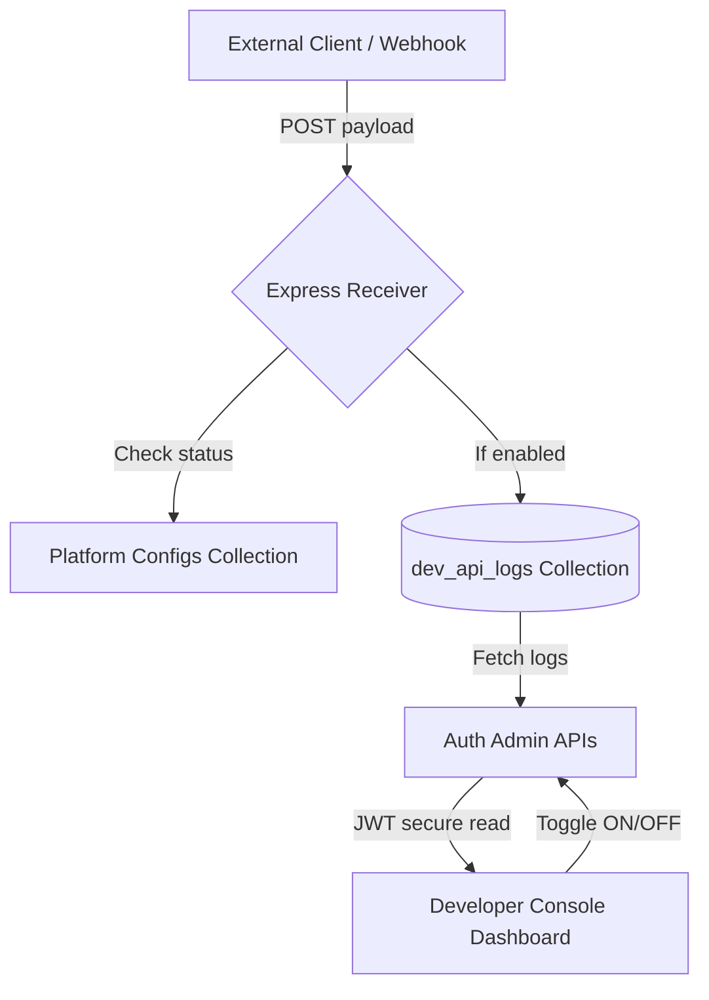

# Developer Logging API & Console Documentation

This document describes the design, API specs, and interface capabilities of the **Developer Request Logging** system in Watch Manager V2. 

The logging system is designed to capture external HTTP payloads (such as webhook requests from n8n workflows, Sunshine Conversations, or test triggers) and present them in a premium terminal-style UI console. This enables developers to inspect headers and body structures, annotate log entries, and use these captured payloads to design new custom node templates in the visual flow palette.

---

## 🏗️ Architecture Overview



The system comprises three main layers:
1. **Public Receiver (`/api/dev/logger`)**: Unauthenticated endpoint to easily accept payloads from external staging environments or local test flows without session token requirements.
2. **MongoDB Storage (`dev_api_logs`)**: Model to store request logs, headers, and annotation notes.
3. **Admin Developer Console**: JWT-protected frontend dashboard to toggle log-capture state, inspect payloads, and save documentation notes.

---

## 🔌 API Reference

### 1. Request Logger Endpoint (Public)
Receive and log any custom HTTP request.

- **URL**: `/api/dev/logger`
- **Method**: `POST`
- **Headers**:
  - `Content-Type: application/json`
  - `x-source` *(Optional)*: Custom identifier for where the request is originating (e.g. `n8n_flow`).
- **Request Body**: Accepts any arbitrary JSON payload.
  ```json
  {
    "event_type": "panic_escalation",
    "site_id": "site_9827",
    "pin_entered": "1234"
  }
  ```
- **Responses**:
  - **`200 OK` (Logging Disabled)**:
    ```json
    { "message": "Developer request logging is currently disabled." }
    ```
  - **`200 OK` (Logged Successfully)**:
    ```json
    { "success": true, "message": "Request captured successfully" }
    ```
  - **`400 Bad Request` (Payload Too Large)**:
    Rejects payloads exceeding **100 KB** to prevent storage bloat.
    ```json
    { "error": "Payload body size exceeds 100 KB developer logger limit." }
    ```

> [!NOTE]
> **Sensitive Headers Removal**:
> The receiver endpoint automatically scrubs out sensitive headers (such as `Authorization` and `Cookie`) prior to database storage to maintain compliance.

---

### 2. Developer Administration APIs (JWT Protected)
These endpoints require an administrative authentication token.

#### Fetch Logged Payloads
- **URL**: `/api/dev/admin/logs`
- **Method**: `GET`
- **Headers**: `Authorization: Bearer <JWT_TOKEN>`
- **Response**: Array of log items sorted by timestamp in descending order (limited to the last 100 entries).

#### Update Annotations
- **URL**: `/api/dev/admin/logs/:id/notes`
- **Method**: `POST`
- **Headers**: `Authorization: Bearer <JWT_TOKEN>`
- **Body**:
  ```json
  {
    "notes": "Triggered from site cancellation button",
    "source": "n8n alarm flow",
    "purpose": "Panic cancellation testing"
  }
  ```
- **Response**: Updated log object.

#### Get Logger Toggle State
- **URL**: `/api/dev/admin/config`
- **Method**: `GET`
- **Headers**: `Authorization: Bearer <JWT_TOKEN>`
- **Response**:
  ```json
  { "enabled": true }
  ```

#### Set Logger Toggle State
- **URL**: `/api/dev/admin/config`
- **Method**: `POST`
- **Headers**: `Authorization: Bearer <JWT_TOKEN>`
- **Body**:
  ```json
  { "enabled": false }
  ```
- **Response**: Updated config state.

---

## 🖥️ Developer Console User Interface

The Developer Console view is located under the `/dev` path in the frontend and is accessible via the sidebar navigation link:

1. **Global Configuration Switch**: Displays the current logger status (Active or Paused). Clicking the switch toggles the logging database receiver on/off.
2. **Endpoint Address Display**: Showcases the target URL (`https://watchmanager.novare.co.za/api/dev/logger`) for quick copying.
3. **Logs Table**: Lists captured HTTP requests with timestamps, HTTP method, source context tags, short purpose descriptions, and annotations.
4. **Interactive JSON Inspector**: Selecting any log row loads its full request body and headers side-by-side in raw syntax highlighted terminal blocks.
5. **Annotation Drawer**: Allows adding notes about what the call was, where it is from, and what it does.

---

## 🧪 Testing and Verification

To verify developer console operations locally:
1. Run a `POST` request to `http://localhost:3001/api/dev/logger` using cURL:
   ```bash
   curl -X POST http://localhost:3001/api/dev/logger \
     -H "Content-Type: application/json" \
     -H "x-source: curl_test" \
     -d '{"status": "online", "nodes": 12}'
   ```
2. Log in as an administrator on `http://localhost:5173/dev`.
3. Toggle logging ON, refresh the console table, and select the cURL request to inspect the payload.
